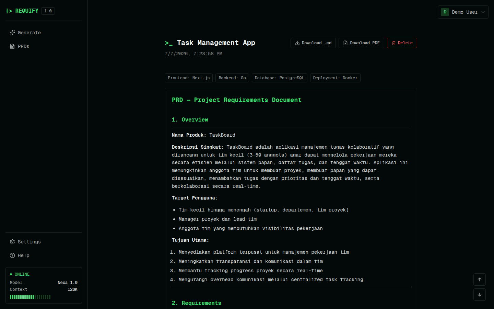

# Requify

AI-powered Product Requirements Document (PRD) generator — describe a product idea, pick a tech stack, and get a full PRD in seconds. Edit it with natural-language instructions, ask questions about it, and export to Markdown or PDF.



## Features

- **Generate** — turn a short prompt and an optional tech stack (frontend, backend, database, deployment) into a complete PRD
- **Edit with AI** — give a natural-language instruction and the AI rewrites the PRD in place
- **Undo** — revert the last AI edit back to the previous version
- **Ask** — ask questions about an existing PRD without modifying it
- **Export** — download any PRD as Markdown or PDF
- **Two AI providers** — Anthropic API (`ANTHROPIC_API_KEY`) or the `claude` CLI already logged in on the host (`claude_code`), selectable per request
- **Auth** — email/password accounts, PRDs are scoped to the owning user

## Tech stack

- **Frontend** — [Next.js 16](https://nextjs.org/) (App Router), React 19, TypeScript, Tailwind CSS 4
- **Backend** — Go, [Anthropic SDK for Go](https://github.com/anthropics/anthropic-sdk-go), [pgx](https://github.com/jackc/pgx)
- **Database** — PostgreSQL 17
- **Deployment** — Docker Compose (Postgres) + standalone Go binary + Next.js server

## Getting started

### Prerequisites

- Go 1.25+
- Node.js 20+
- Docker (for Postgres)

### Setup

```bash
git clone https://github.com/onlyv4ns/requify.git
cd requify

cp backend/.env.example backend/.env
# then fill in AUTH_SECRET and ANTHROPIC_API_KEY in backend/.env
```

### Run

```bash
./run.sh
```

This starts Postgres via Docker Compose, the Go backend on `:8080`, and the Next.js frontend on `:3000`. Open [http://localhost:3000](http://localhost:3000).

### Run manually

```bash
docker compose up -d db

cd backend && go run .      # :8080
cd frontend && npm install && npm run dev   # :3000
```

## Project structure

```
backend/    Go API server (auth, PRD generation/edit/undo/ask)
frontend/   Next.js app (generate, view/edit PRDs, auth)
db/         Postgres schema (init.sql)
run.sh      Starts db + backend + frontend together
```

## License

No license specified.
