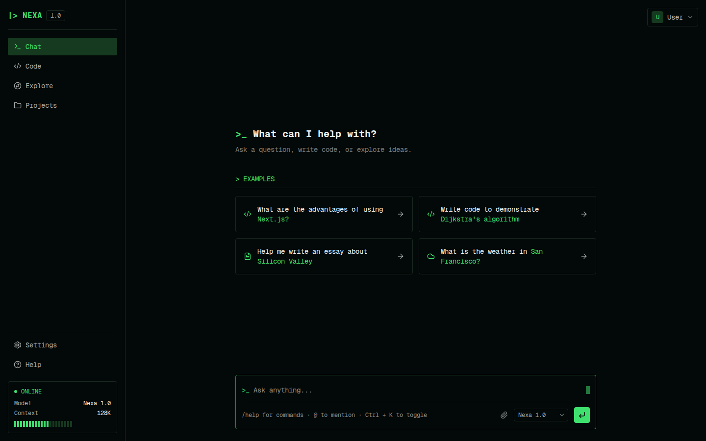

# Nexa

A terminal-styled AI workspace UI built with Next.js — chat, code, explore, and project management in one keyboard-first interface.



## Overview

Nexa is a front-end demo of an AI assistant workspace, inspired by terminal/hacker-style aesthetics. It's fully client-side — all state (chats, projects, code files, settings) is persisted in the browser's `localStorage`, with no backend or real model connected. Chat replies and code generation are mocked so the full UI/UX can be explored end to end.

## Features

- **Chat** — conversational interface with example prompts and a mock assistant reply
- **Code** — multi-file workspace with syntax-highlighted snippets, a run simulator, and prompt-based code generation
- **Explore** — a curated gallery of prompt ideas across code, data, and writing
- **Projects** — group chats and files, create/rename/delete projects
- **Settings** — model selection, preferences, and a danger zone to reset local data
- **Auth flow** — login, register, reset password, and set-new-password screens
- **Public pages** — landing page, documentation, about, contact, terms, and privacy policy
- **Fully responsive** — off-canvas sidebar drawer on mobile, adaptive grids
- **Custom UI primitives** — themed modal/dialog and toggle built without extra dependencies

## Tech stack

- [Next.js 16](https://nextjs.org/) (App Router)
- [React 19](https://react.dev/)
- [TypeScript](https://www.typescriptlang.org/)
- [Tailwind CSS 4](https://tailwindcss.com/)
- [lucide-react](https://lucide.dev/) for icons

## Getting started

### Prerequisites

- Node.js 20+

### Installation

```bash
git clone https://github.com/onlyv4ns/nexa.git
cd nexa
npm install
npm run dev
```

Open [http://localhost:3000](http://localhost:3000) in your browser.

### Build for production

```bash
npm run build
npm run start
```

## Project structure

```
src/
├── app/
│   ├── (app)/         # Chat, Code, Explore, Projects, Settings, Help — behind the app sidebar
│   ├── (auth)/        # Login, register, reset/new password
│   ├── (public)/      # Landing page, documentation, about, contact, terms, policy
│   ├── layout.tsx     # Root layout (fonts, global styles)
│   └── not-found.tsx  # Custom 404 page
├── components/        # Shared UI (Sidebar, ProfileMenu, dialogs, form fields)
└── lib/                # Hooks and helpers (localStorage state, model selection, mock data)
```

## Notes

This project is a UI/UX showcase, not a production chat app — there's no real backend or model API wired up. All "AI" replies and code generation are deterministic mock responses so the interface can be demoed without any external dependency.

## License

No license specified.
